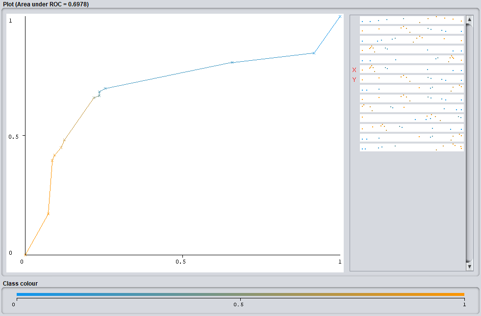
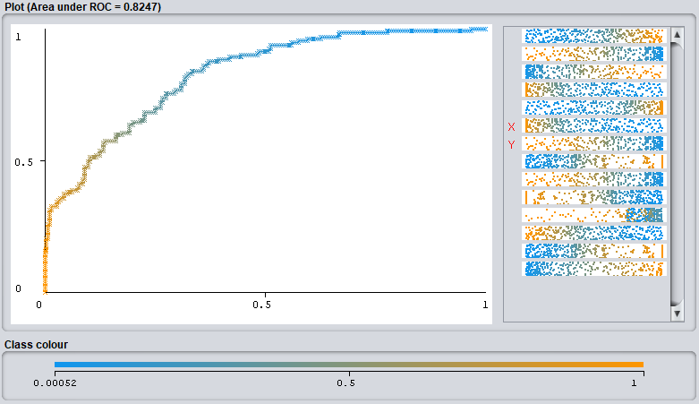

# Exercise Part 1 of 3 - KV Computational Data Analytics (351.008)
Summer term 2020 - Prof. Dr. Johannes Fürnkranz, Florian Beck

Deadline: May 3, 23:59

**Group Members**

| Student ID    | First Name  | Last Name      |
| --------------|-------------|----------------|
| 01555580      | Peter       | Chalupar       |
| 01556188      | Alexander   | Raschl         |
| 01555842      | Stefan      | Brandl         |

> *The submission should be in the form of a self-explanatory presentation (e.g. PDF, OpenOffice or PowerPoint) with a focus on interpretation or analysis.*

\newpage

## 1 Rule Learning: Application and Interpretation (2 P.)

> *In this exercise you will compare JRip, JRip without pruning (by setting usePruning=False) and ConjunctiveRule on different datasets. Therefore, choose ten datasets and try to have as much variance in the number of instances, the number of attributes and the attribute data types as possible.*

**Datasets:**

| Dataset | # Instances | # Attributes¹ | # Continuous¹ | # Discrete | # Classes |
| ------- |------------ | ------------- | ------------- | ---------- | --------- |
| labor | 75 | 16 | 8 | 8 | 2 |
| iris | 150 | 4 | 4 | 0 | 3 |
| vote | 435 | 16 | 0 | 16 (all boolean) | 2 |
| wine | 178 | 13 | 13 | 0 | 3 |
| diabetes | 768 | 8 | 8 | 0 | 2 |
| breast-cancer | 286 | 10 | 0 | 10 | 2 |
| credit-g | 1000 | 21 | 7 | 13 | 2 |
| car | 1728 | 6 | 0 | 6 | 4 |
| contact-lenses | 24 | 4 | 0 | 4 | 3 |
| hypothyroid | 3772 | 29 | 7 | 22 | 4 |

**¹**Without Class Attribute

**Sample output for labor.arff:**
```
JRIP rules:
===========

(wage-increase-first-year <= 2.5) => class=bad (15.0/2.0)
(statutory-holidays <= 10) and (wage-increase-first-year <= 4) => class=bad (5.0/0.0)
(longterm-disability-assistance = no) => class=bad (2.0/0.0)
 => class=good (35.0/0.0)

Number of Rules : 4

Accuracy= 85,965

###########################################################

JRIP rules no Pruning:
===========

(wage-increase-first-year <= 2.8) and (working-hours >= 37) => class=bad (13.0/0.0)
(pension = none) => class=bad (5.0/0.0)
(longterm-disability-assistance = no) => class=bad (2.0/0.0)
 => class=good (37.0/0.0)

Number of Rules : 4

Accuracy= 89,474

###########################################################

Single conjunctive rule learner:
--------------------------------
(wage-increase-first-year <= 2.9) => class = bad

Class distributions:
Covered by the rule:
bad	good
0.909091	0.090909

Not covered by the rule:
bad	good
0.148148	0.851852
Accuracy= 75,439
```

> *1. Compare the number of rules, conditions and predicted classes of the resulting rule sets with respect to:*
> - *the datasets*
> - *the rule classifiers*

**Number of Rules per Classifier and Dataset (including default rule):**

| Dataset         | JRip            | JRip noPruning  | ConjunctiveRule |
| --------------- | --------------- | --------------- | --------------- |
| labor-neg-data  | 4               | 4               | 1               |
| iris            | 3               | 5               | 1               |
| vote            | 4               | 10              | 1               |
| wine            | 5               | 4               | 1               |
| pima_diabetes   | 4               | 11              | 1               |
| breast-cancer   | 3               | 5               | 1               |
| german_credit   | 3               | 13              | 1               |
| car             | 49              | 97              | 1               |
| contact-lenses  | 3               | 4               | 1               |
| hypothyroid     | 5               | 11              | 1               |

ConjunctiveRule always contains 1 Rule, as expected. JRip wihout pruning always uses more rules than with pruning, as expected. However, for the wine dataset the noPruning option results in only 4 instead of 5 rules, wich is odd!

All datasets result in only 3-5 rules with JRip and pruning, even for 'big' datasets like *hypothyroid* or *credit*. However, except for *car* where about 100 and after pruning about 50! rules are used, which is a lot considering that the *car* dataset has only 6 attributes.

**Average number of Conditions per Classifier and Dataset (including default rule):**

| Dataset         | JRip            | JRip noPruning  | ConjunctiveRule |
| --------------- | --------------- | --------------- | --------------- |
| labor-neg-data  | 1,00            | 1,00            | 1               |
| iris            | 1,33            | 2,20            | 1               |
| vote            | 1,50            | 3,70            | 1               |
| wine            | 1,40            | 1,50            | 2               |
| pima_diabetes   | 2,25            | 5,18            | 1               |
| breast-cancer   | 1,33            | 3,20            | 0               |
| german_credit   | 1,67            | 4,15            | 0               |
| car             | 3,98            | 4,53            | 0               |
| contact-lenses  | 1,00            | 2,00            | 0               |
| hypothyroid     | 2,20            | 3,45            | 3               |

We see that JRip without pruning also results in a lot more conditions per rule on average. ConjunctiveRule usually uses only 1 condition or even non at all (resulting in a simple default rule).

The *car* dataset also leads to a lot of conditions per rule, which again is a lot considering that the *car* dataset has only 6 attributes.

Interestingly, the *german_credit* dataset which has 21 attributes leads to only 3 rules with on average 1.67 conditions after pruning.

**Number of Rules predicting certain Classes per Classifier and Dataset:**

| Dataset         | JRip            | JRip noPruning  | ConjunctiveRule |
| --------------- | --------------- | --------------- | --------------- |
| labor-neg-data  | bad=3, good=1   | bad=3, good=1   |  bad=1          |
| iris            | Iris-versicolor=1, Iris-virginica=1, Iris-setosa=1 | Iris-versicolor=3, Iris-virginica=1, Iris-setosa=1 |  Iris-setosa=1  |
| vote            | democrat=1, republican=3 | democrat=1, republican=9 |  republican=1   |
| wine            | 1=2, 2=1, 3=2   | 1=2, 2=1, 3=1   |  1=1            |
| pima_diabetes   | tested_positive=3, tested_negative=1 | tested_positive=10, tested_negative=1 |  tested_negative=1 |
| breast-cancer   | recurrence-events=2, no-recurrence-events=1 | recurrence-events=4, no-recurrence-events=1 |  no-recurrence-events=1 |
| german_credit   | bad=2, good=1   | bad=12, good=1  |  good=1         |
| car             | acc=28, good=11, vgood=9, unacc=1 | acc=64, good=15, vgood=17, unacc=1 |  unacc=1        |
| contact-lenses  | hard=1, none=1, soft=1 | hard=1, none=1, soft=2 |  none=1         |
| hypothyroid     | negative=1, primary_hypothyroid=3, compensated_hypothyroid=1 | negative=1, primary_hypothyroid=5, compensated_hypothyroid=5 |  compensated_hypothyroid=1 |

We can see that for binary class problems usually only one class is used for the rules and the remaining one is handled by the default rule.

> *2. Is there a default rule for all algorithms? If so:*
> - *Which class is usually chosen as default rule?*
> - *How do you interpret the quality of the default rule?*

**Default Rules per Classifier and Dataset:**

| Dataset         | JRip            | JRip noPruning  | ConjunctiveRule      |
| --------------- | --------------- | --------------- | --------------- |
| labor-neg-data  |  => class=good (35.0/0.0) |  => class=good (37.0/0.0) | -                    |
| iris            |  => class=Iris-virginica (50.0/0.0) |  => class=Iris-virginica (50.0/0.0) | -                    |
| vote            |  => Class=democrat (262.0/5.0) |  => Class=democrat (270.0/5.0) | -                    |
| wine            |  => class=2 (58.0/1.0) |  => class=2 (57.0/0.0) | -                    |
| pima_diabetes   |  => class=tested_negative (545.0/102.0) |  => class=tested_negative (610.0/110.0) | -                    |
| breast-cancer   |  => Class=no-recurrence-events (245.0/55.0) |  => Class=no-recurrence-events (261.0/60.0) | Rule is default ( => Class = no-recurrence-events) |
| german_credit   |  => class=good (767.0/162.0) |  => class=good (878.0/178.0) | Rule is default ( => class = good) |
| car             |  => class=unacc (4.0/0.0) |  => class=unacc (6.0/0.0) | Rule is default ( => class = unacc) |
| contact-lenses  |  => contact-lenses=none (6.0/1.0) |  => contact-lenses=none (3.0/0.0) | Rule is default ( => contact-lenses = none) |
| hypothyroid     |  => Class=negative (92.0/5.0) |  => Class=negative (79.0/0.0) | -                    |

JRip always (at least for our datasets) creates a DefaultRule. ConjunctiveRule creates per Definition only 1 Rule - howerever an implicit default rule is used at classification, when for instances not covered by the Rule the most prominent class not covered will be used. The explicit default Rules are always the same for all classifiers.

The quality of the default rules is usually pretty good on the training set, with a homogeneous set of instances covered. However, for the datasets diabetes, breast-cancer and german_credit the default rule is pretty heterogenic with about 20% missclassification.

Interestingly, for a view datasets the single ConjunctiveRule results in a explicit default rule with no rule body. The accuracy (see below) however is not drastically better than for JRip, indicating that there is really hard to learn a meaningful rule for this datasets.

> *3. On the basis of the previous subtasks, can you make a statement which of the datasets is the easiest or best to learn?*

When only looking at the learned rules and not on the performance/accuracy it is hard to judge the datasets. A low number of short rules can indicate a simple dataset, however, in the extreme case it can also indicate an hard dataset where no rule could be found.

The *iris*, *labor*, and *contact-lenses* datasets result in very few and very simple rules for all three classifiers and homogeneous default rules indicating easy to learn datasets. However, when looking at the accaracy this is clearly not true for *contact-lenses*.

The big *hypothyroid* or *german_credit* datasets also result in relatively few rules, especially after pruning, indicating good learnability, which however is not true for *german_credit* when looking at the true accuracy.

When looking at the accuracy with 10-Fold CV (see below) we can clearly see that *hypothyroid* or *vote* are the easiest datasets, as even the Sinlge Conjunctive Rule gets >97% and >95% accuracy for those.

> *4. Perform a Friedman-Nemenyi test on the results and check whether there is a significant difference between the performance of the classifiers.*

**Accuracies and Ranks for the different Datasets and Classifiers (10-Fold CV):**

```
Dataset         JRip            JRip noPruning  ConjunctiveRule
labor-neg-data  85,964912 (2)   89,473684 (1)   75,438596 (3)
iris            93,333333 (1)   93,333333 (1)   66,666667 (3)
vote            95,172414 (2)   95,172414 (2)   95,402299 (1)
wine            89,887640 (2)   91,573034 (1)   63,483146 (3)
pima_diabetes   75,651042 (1)   72,265625 (2)   69,401042 (3)
breast-cancer   73,426573 (1)   73,426573 (1)   71,678322 (3)
german_credit   71,500000 (2)   72,900000 (1)   70,000000 (3)
car             86,111111 (2)   88,194444 (1)   70,023148 (3)
contact-lenses  79,166667 (1)   70,833333 (2)   54,166667 (3)
hypothyroid     99,443266 (1)   99,178155 (2)   97,083775 (3)
---------------------------------------------------------------
AVG RANK        1,500000        1,400000        2,800000
```

```
Perform the Friedman statistics test:
E.g. k = 3, N = 10
Chi²F = 12N / k(k+1)  *  ( SUM(avgRanks²) - k(k+1)² / 4 )
Chi²F = 12*10 / 3*4  *  ( SUM(avgRanks²) - 3*4 / 4 )
Sum(avgRanks²) = 12,050000 (from table above)
Chi²F = 8.0
Chi²(0.95,2) = 5.991   -> see https://people.richland.edu/james/lecture/m170/tbl-chi.html

χ²(0.95;2) = 5,991000 < 8,000000 = χ²F
Null hypotheses successfully rejected with p = 0.95!
```

```
Perform the Nemenyi post-hoc test:
(which can be performed because the null hypothesis of the Friedman is rejected)
q_alpha_0.05_#c3 = 2.343
Critical Distance between pairs of avgRanks:
CD = q_alpha * Math.sqrt(k * (k + 1) / (6 * n))
CD = 1,047821
```

With a CD of ~1.05 we can show that both JRip Classifiers are significantly better than ConjunctiveRule. As 2.8 > 1.5 + 1.05 (or 1.04). However JRip with pruning is NOT significant better than JRip without pruning.

*Java Code, which we used to calculate the Friedman statistics and CD:*
```java
private static void performFriedmanNemenyiTests(final double[] avgRanks, final double n) {
  System.out.println("Perform the Friedman statistics test:");
  final double k = avgRanks.length;
  final double sumAvgRanks2 = DoubleStream.of(avgRanks).map(a -> a * a).sum();
  System.out.println(String.format("Sum(avgRanks²) = %f", sumAvgRanks2));
  final double chi2F = 12 * n / k * (k + 1) * (sumAvgRanks2 - k * (k + 1) * (k + 1) / 4);
  final double chi2 = 5.991; // Chi²(0.95,k-1)
  if (chi2 < chi2F) {
    System.out.println(String.format("χ²(0.95;2) = %f < %f = χ²F", chi2, chi2F));
    System.out.println("Null hypotheses successfully rejected with p = 0.95!");

    System.out.println("Perform the Nemenyi post-hoc test: (which can be performed because the null hypothesis of the Friedman is rejected)");
    System.out.println("q_alpha_0.05_#c3 = 2.343 ");
    final double q_alpha = 2.343;
    final double CD = q_alpha * Math.sqrt(k * (k + 1) / (6 * n)); // Critical Distance between pairs of avgRanks
    System.out.println(String.format("CD = %f", CD));
  } else {
    System.out.println(String.format("χ²(0.95;2) = %f >= %f = χ²F", chi2, chi2F));
    System.out.println("Null hypotheses could NOT be rejected with p = 0.95!");
  }
}
```

\newpage

## 2 Noise and Pruning (2 P.)

> Choose the dataset with the highest accuracy in the previous task and at least 50 instances.

`hypothyroid.arff` from the weka sample data sets.

```
Num Instances:     3772
Num Attributes:    30
Num Continuous:    7 (Int 1 / Real 6)
Num Discrete:      23
```

> Disturb the class information in this dataset by adding different levels of noise (for example, 5%, 10%, 25%, 50%, 75%, 100%) with the filter `weka.filters.unsupervised.attribute.AddNoise` during pre-processing. Observe the accuracy and size of the learned trees on the original and the noisy datasets for the tree classifier `J48`

>- with default parameters.
>- without pruning (`unpruned=True` / `-U`) and minimum one instance per leaf (`minNumObj=1` / `-M 1`).

**5% Noise**

|                  | default parameters | unpruned & minNumObj=1 | gridSearched(confidenceFactor, minNumObj) |
|------------------|--------------------|------------------------|-------------------------------------------|
| Number of Rules  | 15                 | 227                    | 10                                        |
| Size of Tree     | 29                 | 414                    | 19                                        |
| minNumObj        | 2                  | 1                      | 2                                         |
| ConfidenceFactor | 0.25               | 0.25                   | 0.001                                      |
| Unpruned         | false              | true                   | false                                     |
| Accuracy         | 94.49              | 92.10                  | 94.49                                     |

**10% Noise**

|                  | default parameters | unpruned & minNumObj=1 | gridSearched(confidenceFactor, minNumObj) |
|------------------|--------------------|------------------------|-------------------------------------------|
| Number of Rules  | 13                 | 381                    | 9                                         |
| Size of Tree     | 25                 | 722                    | 17                                        |
| minNumObj        | 2                  | 1                      | 2                                         |
| ConfidenceFactor | 0.25               | 0.25                   | 0.001                                     |
| Unpruned         | false              | true                   | false                                     |
| Accuracy         | 89.48              | 84.15                  | 89.53                                     |

**25% Noise**

|                  | default parameters | unpruned & minNumObj=1 | gridSearched(confidenceFactor, minNumObj) |
|------------------|--------------------|------------------------|-------------------------------------------|
| Number of Rules  | 13                 | 820                    | 9                                         |
| Size of Tree     | 25                 | 1588                   | 17                                        |
| minNumObj        | 2                  | 1                      | 2                                         |
| ConfidenceFactor | 0.25               | 0.25                   | 0.001                                     |
| Unpruned         | false              | true                   | false                                     |
| Accuracy         | 74.42              | 62.20                  | 74.60                                     |

**50% Noise**

|                  | default parameters | unpruned & minNumObj=1 | gridSearched(confidenceFactor, minNumObj) |
|------------------|--------------------|------------------------|-------------------------------------------|
| Number of Rules  | 640                | 1314                   | 11                                        |
| Size of Tree     | 1240               | 2558                   | 21                                        |
| minNumObj        | 2                  | 1                      | 2                                         |
| ConfidenceFactor | 0.25               | 0.25                   | 0.03                                      |
| Unpruned         | false              | true                   | false                                     |
| Accuracy         | 39.26              | 35.55                  | 49.68                                     |

**75% Noise**

|                  | default parameters | unpruned & minNumObj=1 | gridSearched(confidenceFactor, minNumObj) |
|------------------|--------------------|------------------------|-------------------------------------------|
| Number of Rules  | 817                | 1492                   | 866                                       |
| Size of Tree     | 1597               | 2911                   | 1689                                      |
| minNumObj        | 2                  | 1                      | 2                                         |
| ConfidenceFactor | 0.25               | 0.25                   | 0.45                                      |
| Unpruned         | false              | true                   | false                                     |
| Accuracy         | 24.36              | 25.80                  | 24.89                                     |

**100% Noise**

|                  | default parameters | unpruned & minNumObj=1 | gridSearched(confidenceFactor, minNumObj) |
|------------------|--------------------|------------------------|-------------------------------------------|
| Number of Rules  | 519                | 1016                   | 1                                         |
| Size of Tree     | 1013               | 1983                   | 1                                         |
| minNumObj        | 2                  | 1                      | 2                                         |
| ConfidenceFactor | 0.25               | 0.25                   | 0.001                                     |
| Unpruned         | false              | true                   | false                                     |
| Accuracy         | 33.01              | 33.51                  | 34.15                                     |

> Experiment a little with the parameters `-C` (confidenceFactor) and `-M` for pruned trees and try to find the combination that gives the highest accuracy on the data disturbed with 10% noise.

Done for every given percentage of noise. See tables above.

> Note: A x% noise level is created by replacing the example label at x% of all examples with a randomly selected label from one of the other classes. For two-class problems, you will notice that the performance at 100% noise is identical to the performance at 0% noise (Why?).

For a binary label, 100% noise would just correspond to an inversion of the label, thus not changing the behavior.

> In this case, adapt the bounds in an appropriate way (here 50% noise corresponds to random data).

There are 4 different class labels { `negative`, `compensated_hypothyroid`, `primary_hypothyroid`, `secondary_hypothyroid` }, thus the problem does not occur. 

\newpage

## 3 Evaluation Methods (2 P.)

> *In this task different evaluation methods using Weka are to be applied and their results discussed. Apply the rule classifier JRip to five datasets (e.g. those from task 1) by first dividing each dataset into two equal stratified parts, a training set and a validation set.*  

 We chose the 5 Datasets which had the most samples among the datasets provided by Weka by default.

> *1. Now train JRip on each of these training sets and evaluate the accuracy (percentage of
     correctly classified examples) of the resulting classifiers (without changing customized
     options like random seed) using:*
> - *1x5 cross-validation*
> - *1x10 cross-validation*
> - *1x20 cross-validation*
> - *leave-one-out*
> - *the training set itself*

The following table shows the achieved accuracies using the mentioned validation method:

| Dataset       | 1x5 CV  | 1x10 CV | 1x20 CV | LOOCV   | Self    |
|---------------|---------|---------|---------|---------|---------|
| supermarket   | 74,330% | 75,281% | 75,756% | 75,238% | 83,967% |
| hypothyroid   | 99,046% | 98,993% | 98,993% | 98,993% | 99,205% |
| segment       | 90,000% | 90,533% | 91,467% | 90,533% | 96,667% |
| german_credit | 69,200% | 72,400% | 73,200% | 72,200% | 75,000% |
| unbalanced    | 98,598% | 98,598% | 98,598% | 98,364% | 98,598% |

> *How do you assess the quality of the accuracy estimates obtained?*  

At first, it can be observed that evaluating our model using the train set (*Self*) results in the highest obtained accuracies.
This is not surprising as the model has already seen the train data during the training process,
thus it is easier for the model to correctly classify seen data.  
As a result, using the train set for evaluation leads to overly optimistic results and is generally considered as bad-practice.

Second, the accuracies provided by 1x20 CV and leave-one-out-CV (*LOOCV*) are quite the same. As the train datasets,
are fairly small (at most 2300 samples) a split into 20 folds should already be a good approximation to leave-one-out-CV.

The 5 fold cross validation is more separated from the  other methods, which can be explained by the relatively low amount of folds.
Thus, the results are more dependent on the random splits, as there is also more *unseen* data present on each cross validation iteration.  

Interestingly, the accuracies obtained using the *unbalanced* dataset are fairly the same, which can explained by the overall class distribution,
which contains exactly 98.598% of negatives and only 1,4% positive examples.

To sum this up, we would either pick the 1x20 CV or the leave-one-out-CV if we have enough computing resources as our evaluation method of choice.

> *2. Repeat the previous steps using:*
> - *10x10 cross-validation*
> - *5x2 cross-validation*
> - *Compare the accuracy estimates obtained in
    this way with the estimates from the previous task. In your opinion, does a smart selection
    of random seeds lead to a better estimation?*   

In the following, we see that the 5x2 CV results in large differences in accuracy compared to our preferred validation methods from before.
Only the results for the unbalanced dataset are the same,
as the learned ruleset is possibly exactly the same for all validation methods due to the highly skewed class distribution.

| Dataset       | 1x5 CV  | 1x10 CV | 1x20 CV | LOOCV   | Self    | 10x10 CV | 5x2 CV  |
|---------------|---------|---------|---------|---------|---------|----------|---------|
| supermarket   | 74,330% | 75,281% | 75,756% | 75,238% | 83,967% | 75,065%  | 73,526% |
| hypothyroid   | 99,046% | 98,993% | 98,993% | 98,993% | 99,205% | 99,125%  | 99,024% |
| segment       | 90,000% | 90,533% | 91,467% | 90,533% | 96,667% | 89,987%  | 86,827% |
| german_credit | 69,200% | 72,400% | 73,200% | 72,200% | 75,000% | 71,540%  | 70,880% |
| unbalanced    | 98,598% | 98,598% | 98,598% | 98,364% | 98,598% | 98,598%  | 98,598% |

The main reason for multiple cross validation computations is to reduce the impact of the initial split into *N* folds.  
Thus, if it happens that a "bad" split is made when using only 1x10 CV, this can result in slightly misleading results.   
If using 10x10 CV, 10 separate splits are made and thus a single "bad" split would not have a major impact.  
The mentioned differences of the 5x2 CV are caused by only using 2 folds for each split, which can result in highly biased folds.
As a result, 10x10 cross validation should definitely be preferred over 5x2 cross validation.   

Furthermore, we think that a _smart_ selection of random seeds should actually not lead to better estimation results,
if a proper random sampling is made using this seed.


> *3. Determine the accuracy on the validation set by using it as a test set. Assuming that
      the validation set is a real use case, how do you assess the estimates of the evaluation
      methods from the previous two tasks?*  

Surprisingly, the accuracies obtained via evaluating the models using the validation set, which are listed below,
are most of the time higher, than the accuracy results obtained by performing cross validation on the train set.
While this is typically not a common thing to see, it can be explained via assuming that a "lucky" split has been made
 during the Stratified Splits, resulting in a validation fold that is easy to predict for the trained classifier.
Furthermore, it could be that the data is very homogeneous and as the model is trained on the full training set whilst evaluating it using the validation set,
it has seen _more_ data during the training process, which can enhance its accuracy.

| Dataset       | 1x5 CV  | 1x10 CV | 1x20 CV | LOOCV   | Self    | 10x10 CV | 5x2 CV  | Validation |
|---------------|---------|---------|---------|---------|---------|----------|---------|------------|
| supermarket   | 74,330% | 75,281% | 75,756% | 75,238% | 83,967% | 75,065%  | 73,526% | 79,490%    |
| hypothyroid   | 99,046% | 98,993% | 98,993% | 98,993% | 99,205% | 99,125%  | 99,024% | 99,099%    |
| segment       | 90,000% | 90,533% | 91,467% | 90,533% | 96,667% | 89,987%  | 86,827% | 94,000%    |
| german_credit | 69,200% | 72,400% | 73,200% | 72,200% | 75,000% | 71,540%  | 70,880% | 71,500%    |
| unbalanced    | 98,598% | 98,598% | 98,598% | 98,364% | 98,598% | 98,598%  | 98,598% | 98,598%    |

> *4. Select a sufficiently large dataset of a binary classification problem and compare the ROC
   curve and AUC for __J48__ and __NaiveBayes__.*

We selected the diabetes dataset which consists of 768 samples being 500 negative and 268 positive samples.
We also perform a 50% Stratified Split in order to remain consistent with the previous tasks.

- __J48__
```
=== Summary ===

Correctly Classified Instances         285               74.2188 %
Incorrectly Classified Instances        99               25.7813 %
Kappa statistic                          0.3806
Mean absolute error                      0.3102
Root mean squared error                  0.4605
Relative absolute error                 68.1752 %
Root relative squared error             97.3324 %
Total Number of Instances              384     
```

```
=== Detailed Accuracy By Class ===

                 TP Rate  FP Rate  Precision  Recall   F-Measure  MCC      ROC Area  PRC Area  Class
                 0,875    0,519    0,769      0,875    0,818      0,390    0,698     0,767     tested_negative
                 0,481    0,125    0,660      0,481    0,556      0,390    0,698     0,542     tested_positive
Weighted Avg.    0,742    0,387    0,732      0,742    0,730      0,390    0,698     0,691     
```

```
=== Confusion Matrix ===

   a   b   <-- classified as
 223  32 |   a = tested_negative
  67  62 |   b = tested_positive
```



- __NaiveBayes__

```
=== Summary ===

Correctly Classified Instances         290               75.5208 %
Incorrectly Classified Instances        94               24.4792 %
Kappa statistic                          0.4406
Mean absolute error                      0.2906
Root mean squared error                  0.4064
Relative absolute error                 63.8822 %
Root relative squared error             85.9146 %
Total Number of Instances              384     
```

```
=== Detailed Accuracy By Class ===

                 TP Rate  FP Rate  Precision  Recall   F-Measure  MCC      ROC Area  PRC Area  Class
                 0,835    0,403    0,804      0,835    0,819      0,441    0,825     0,898     tested_negative
                 0,597    0,165    0,647      0,597    0,621      0,441    0,825     0,731     tested_positive
Weighted Avg.    0,755    0,323    0,751      0,755    0,753      0,441    0,825     0,842     
```

```
=== Confusion Matrix ===

   a   b   <-- classified as
 213  42 |   a = tested_negative
  52  77 |   b = tested_positive
```



| Dataset   |   Method   |   AUC   |
| ----------|------------|---------|
| diabetes  | NaiveBayes | 0.8247  |
| diabetes  | J48        | 0.6978  |

Generally, it can be observed that the AUC is considerably higher when using __NaiveBayes__ for classification than using the __J48__.  
__NaiveBayes__ assigned 5 more data samples to the correct class than __J48__.
