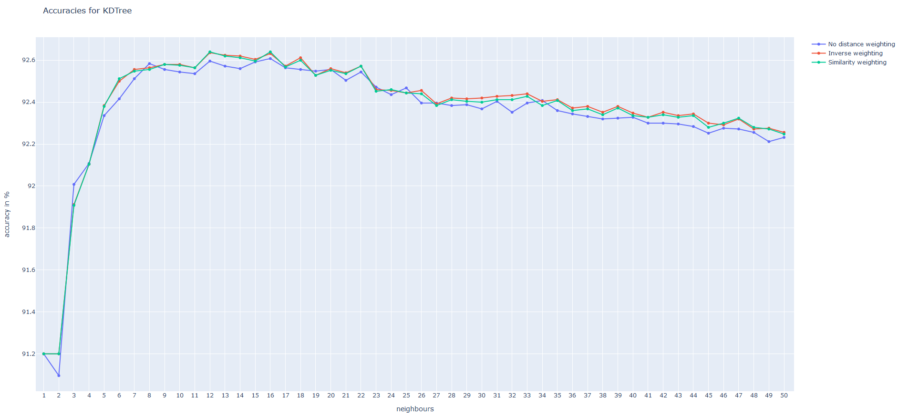

# Exercise Part 3 of 3 - KV Computational Data Analytics (351.008)
Summer term 2020 - Prof. Dr. Johannes Fürnkranz, Florian Beck

Deadline: July 12, 23:59

**Group Members**

| Student ID    | First Name  | Last Name      |
| --------------|-------------|----------------|
| 01555580      | Peter       | Chalupar       |
| 01556188      | Alexander   | Raschl         |
| 01555842      | Stefan      | Brandl         |

> *The submission should be in the form of a self-explanatory presentation (e.g. PDF, OpenOffice or PowerPoint) with a focus on interpretation or analysis.*

\newpage

## Stream Mining: Hoeffding Trees (1.5 P.)

> *In this exercise you will compare the decision tree classifiers J48 and HoeffdingTree which
   uses an incremental approach suitable for stream mining. Create a new random dataset by choosing Generate in the main tab. Choose the generator RandomRBF and run it with the standard settings. Compare the classification accuracies, and the time taken to build model of J48 and HoeffdingTree on the generated dataset. Repeat the classification for more generated datasets of bigger size by increasing -n (numExamples) (for example,100, 250, 500, 1,000, ..., 100,000). For the three biggest datasets, also compare the size of the trees, and the total execution time (in seconds; you can find the start and end time in the log). What conclusions about the classifiers can be drawn from the performances?*

The table below comprises the overall results, obtained during the requested tests.  

A full example console output can be found in [example_output_log.txt](https://raw.githubusercontent.com/Steve2608/Computational-Data-Analytics/master/src/EX6/example_output_log), as it was simply far too big for including it in this report. 

| N_Samples            | J48_Acc (%)          | Hoeffding_Acc (%)    | J48_N_Leaves         | Hoeffding_N_Leaves   | J48_Time (s)         | Hoeffding_Time (s)  |
|----------------------|----------------------|----------------------|----------------------|----------------------|----------------------|---------------------|
| 100                  | 64,000               | 58,000               | 13                   | 1                    | 0,054                | 0,036               |
| 250                  | 74,800               | 67,600               | 33                   | 1                    | 0,064                | 0,032               |
| 500                  | 77,400               | 64,000               | 79                   | 1                    | 0,088                | 0,038               |
| 1000                 | 80,200               | 62,500               | 115                  | 1                    | 0,200                | 0,061               |
| 10000                | 89,360               | 74,440               | 707                  | 7                    | 2,459                | 0,700               |
| 50000                | 91,858               | 86,214               | 2375                 | 20                   | 28,205               | 1,564               |
| 100000               | 92,145               | 88,450               | 3833                 | 44                   | 91,481               | 3,171               |
 
A few general trends can be observed for all dataset sizes:
- The achieved accuracy (10-Fold-CV) is always higher for the _J48_ compared to the _Hoeffding Tree_
- The number of leaves of _J48_ is always (far) larger.
- Especially for large datasets the _Hoeffding Tree_ is far faster to fit than the _J48_
- The overall achieved accuracy increases with the dataset size for both classifiers (more data, better estimates)

__Conclusions__  
Interestingly, the number of leaves for _Hoeffding Trees_ up to size 1000 is only 1. The predictions are solely made through a single instance of adaptive _Naive Bayes_ _(standard params)_.

As the _Hoeffding Tree_ is specifically designed for handling large datasets/streams it is not surprising that its training times outperform the training times of the _J48_.  
However, this comes with the cost of loosing some of the accuracy, the _J48_ provides.  
Thus, one could argue that the _Hoeffding Tree_ trades some accuracy for better performance and simpler/lightweight models. 

## Distance-based Methods (1.5 P.)

> *Weka provides the classifier IBk which has implemented different nearest neighbor approaches
   discussed in the lecture. To test them, create a new random dataset by choosing Generate in the
   main tab. Choose the generator RandomRBF and set -c (numClasses) to 10 and -n (numExamples)
   to 25,000.*

> *1. Compare the classification results and the execution times with `LinearNNSearch`, `KDTree`
      and `BallTree` as nearestNeighbourSearchAlgorithm.*

|           | LinearNNSearch | KDTree | BallTree |
|-----------|----------------|--------|----------|
| time (ms) | 20,457         | 2,578  | 12,593   |
| accuracy  | 91.2           | 91.2   | 91.2     |

Since the default Constructor of the `IBk` uses `k=1` supports. Thus, the accuracy will stay constant over all different kinds of algorithms. 

For `k=1` the only thing that matter is the time to fit / evaluate the classifier - for this and the following experiments we used a 10-CV. 

> *2. For the fastest search algorithm in the previous task, compare the accuracies for different
       numbers of nearest neighbors (in Weka: -K (KNN)).*

From the table above, we can see that `KDTree` is the fastest algorithm by a factor of roughly `5` and `8` respectively.
To exhaustively analyse the performance of the `KDTree` algorithm, we plot the accuracy for all possible values of `k` in `[1, 50]`.

> *2. For the best three values for k, does a
       distance weight method further improve the accuracy?*

| k=16     | no distance weighting | inverse distance weighting | similarity distance weighting |
|----------|-----------------------|----------------------------|-------------------------------|
| accuracy | 92.608                | 92.632                     | **92.64**                     |

| k=12     | no distance weighting | inverse distance weighting | similarity distance weighting |
|----------|-----------------------|----------------------------|-------------------------------|
| accuracy | 92.596                | 92.636                     | **92.64**                     |

| k=15     | no distance weighting | inverse distance weighting | similarity distance weighting |
|----------|-----------------------|----------------------------|-------------------------------|
| accuracy | 92.592                | **92.604**                 | 92.596                        |

From this small table, we can see that using a distance weighting does slightly increase the performance of the classifier.
Other than minor fluctuation, however, the exact choice between *inverse distance weighting* and *similarity distance weighting* does not matter. 

For a full list of results see [gist.github.com](https://gist.github.com/Steve2608/9e56e1b5a3fb7b4b8f5112e9b59e9017).

### Clustering (2 P.)

> *The dataset 'cities_greece' contains the latitudes and longitudes of 9,882 cities in Greece 3. In
   this exercise you will apply the algorithms SimpleKMeans and DBSCAN to cluster the cities. The
   latter must first be installed via the package manager. To do this, open it in the start menu via
   Tools > Package manager, search for optics_dbScan and install the package. If the clusterer
   DBSCAN does not appear as an option when you choose the clusterer, you might have to restart
   Weka before using it.
   Load the dataset into Weka, go to the Cluster tab and retain the standard evaluation settings for
   all experiments (Cluster mode = Use training set).*

> *1. Apply SimpleKMeans with k = 2 (in Weka: -N (numClusters)). Have a look at the computed
      clusters by right clicking in the result list and selecting Visualize cluster assignments
      (with longitude as x-axis and latitude as y-axis). Repeat the clustering with different
      values for k, compare the results and find an appropriate value for k. For this k, apply
      the cluster with three more different seeds. Does the result change? If yes, how much?*
>

### Visualization of Cluster Assignments for different K
| | | |
|:-------------------------:|:-------------------------:|:-------------------------:|
| K=2 -> E=441.32  |  K=3 -> E=274.38  | K=4 -> E=172.80  |
| K=5 -> E=132.65  |  K=10 -> E=59.85  | K=15 -> E=39.77  |
| K=20 -> E=29.53  |  K=25 -> E=23.97  | K=50 -> E=11.84  |

By visual inspection, we argue that K=15 is an appropriate value, as the cluster assignment shows different regions relatively seperated like mainland Greece, the Peloponnese peninsula, Kreta and the other smaller Islands. A higher value of K however does not really help to seperate this main regions any better, but just seperates them into more sub-clusters. Of course, this visual inspection of cluster assignment is extremely subjective and judging a "good" clustering would depend on the actual use case. As expected, the "within cluster sum of squared errors" (E) decreases for higher values of K.

### K = 15, for different seeds
| | |
|:-------------------------:|:-------------------------:|
| K=15, Seed=10 -> E=39.77  | K=15, Seed=20 -> E=40.97  | 
| K=15, Seed=30 -> E=40.27  | K=15, Seed=40 -> E=38.12  |

Different seeds do not change the "within cluster sum of squared errors" (E) much, except for the last example, where Kreta is divided, which might be considered unsatisfactory from a subjective visual standpoint, but decreases the error. Also in other areas the location and size of the clusters changes quite a lot, as can be seen in the visualizations.

> *2. Now use DBSCAN to cluster the cities. If you use the standard settings of DBSCAN you will
      just get a single cluster. Adjust the parameters -E (epsilon) and -M (minPoints) to get a
      more appropriate outcome (Hint: You have to decrease epsilon). Compare the number
      of clusters and the number of unclustered instances. What is the best configuration in
      your opinion? Compute for the "best" number of clusters the outcome of SimpleKMeans
      and compare the results.*

### Finding the right DBSCAN Parameters
| epsilon | min points | # clusters | # unclustered |   |
| ------- | --------- | ---------- | -------------- | - |
| 0.9  | 6 | 1 | 0 | default settings |
| 0.07 | 6 | 2 | 1 | first real clustering with e <= 0.07 |
| 0.06 | 6 | 5 | 2 ||
| 0.05 | 6 | 8 | 4 ||
| 0.04 | 6 | 10 | 8 ||
| 0.02 | 6 | 24 | 36 ||
| 0.015 | 6 | 31 | 46 ||
| 0.015 | 3 | 36 | 15 | most appropriate visual result |
| 0.01 | 6 | 42 | 151 ||
| 0.005 | 6 | 195 | 3562 ||

| | |
|:-------------------------:|:-------------------------:|
| e=0.07, m=6  | e=0.06, m=6  | 
| e=0.05, m=6  | e=0.04, m=6  | 
| e=0.03, m=6  | e=0.02, m=6  |
| e=0.015, m=6  | e=0.015, m=3  |
| e=0.01, m=6  | e=0.005, m=6  | 

The most appropriate visual result can be achieed with eps=0.015. This results in a clear seperation of mainland Greece including the Peloponnese peninsula and nearly all island groups as seperate clusters. As there are some island (or island groups) which contain only about a few cities, we also set the 'min points' to 3, to create more small clusters instead of outliers.  
If we want the Peloponnese peninsula to be a seperate cluster, we would have to set eps even smaller (e.g. 0.005) which results in a lot of small clusters and over 36% outliers.

### Comparision with KMEANS

| | |
|:-------------------------:|:-------------------------:|
| DBSCAN e=0.015, m=3  | KMEANS k=36  | 

If we compare the "best" DBSCAN with KMEANS using the same number of clusters ignoring outliers (=36), we can see that with KMEANS the mainland is devided in multiple small parts, while all the islands are grouped to only about 3 big clusters. With DBSCAN, the mainland is one big cluster with the islands being many seperate small clusters.  
This shows how DBSCAN can handle arbitrary complex decision (or cluster) boundaries, while KMEANS is limited to elipsoid clusters and can't handle the complex geographic shape of a country. However, with DBSCAN the epsilon parameter also has to be carefully tuned for an appropriate result, as it is the case for number k of clusters with KMEANS.
